# Reima Headless Architecture

This is an attempt at documenting the headless architecture at Reima.

Note that it is notoriously difficult to keep documentation up to date, so this is intended for high-level illustrative purposes only. There are a lot of links to the relevant code and services, so when in doubt, see the links for details on how these things work in reality.

## Site deployment and hosting

*The US site has been used here as an example, but all sites (apart from FBB) should work in the same way.*

[Open in full-sceen](https://raw.githubusercontent.com/reima-ecom/architecture/main/site.mmd.svg)

How to read the flowchart:

- `github-reima-ecom`: Our organization in GitHub, containing repositories with their actual names
- `repo-*`: GitHub repositories
- `api-*`: External APIs
- `cms-forestry`: Forestry CMS (self explanatory?)
- `cloudflare-workers`: Functions running on the edge on Cloudflare CDN
- `netlify`: Hosting platform
- `hugo-*`: Code and content for use with the [Hugo static site generator](https://gohugo.io)
- `gha-*`: GitHub Actions, i.e. CI/CD workflows running on GitHub infrastructure

The chart contains nodes with links, but for these to work you need to view the raw SVG file. Do this by opening the image in full-sceen via the link above.
